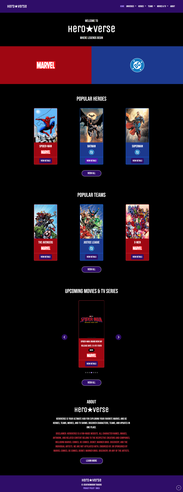
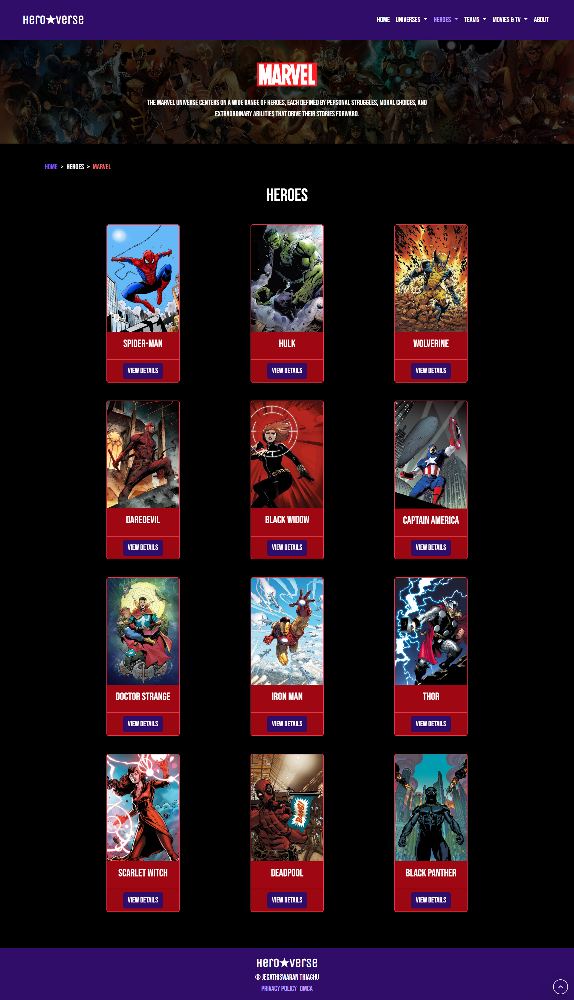
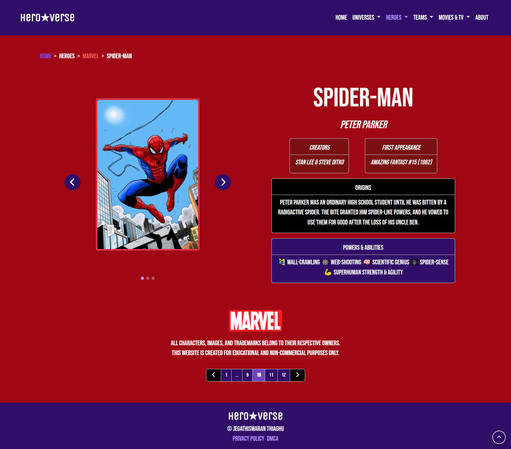
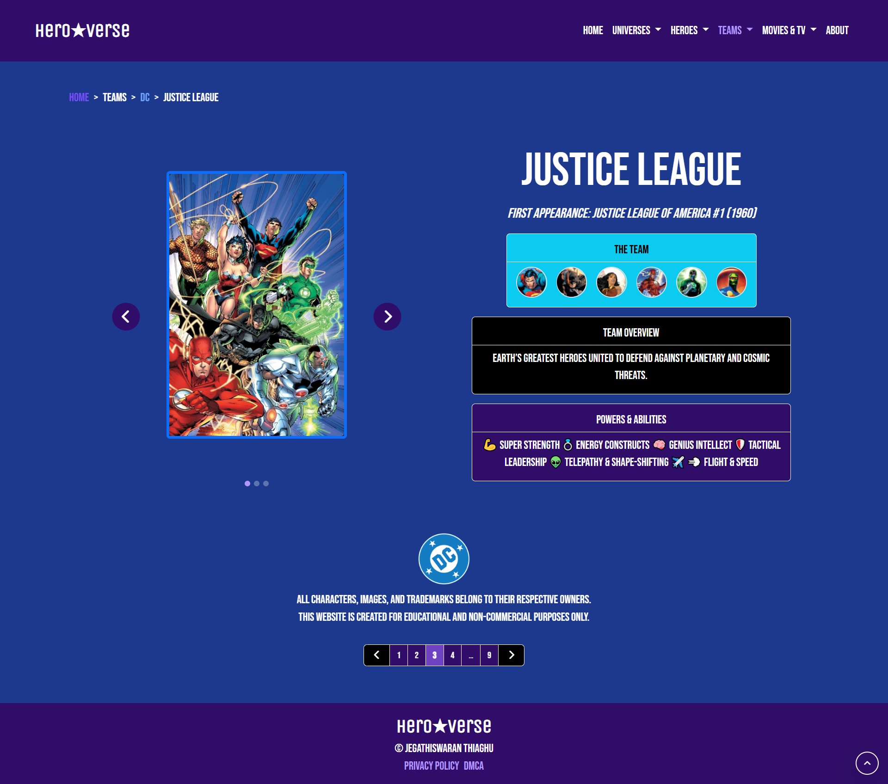
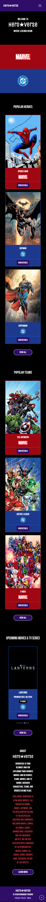

# Hero★Verse — Marvel & DC Universe Fan Information Hub Website 🦸‍♂️⚡


> A fan-made multi-page information hub website dedicated to the Marvel and DC universes. Built as a frontend portfolio project to demonstrate real-world HTML, Sass/SCSS, JavaScript, and Bootstrap 5 skills across a large-scale multi-page architecture.

---

## 🔗 Live Demo

**🌐 [View Live Site](https://heroverse-jega1312.vercel.app)**

---

## 📸 Preview

### Desktop View 🖥






### Mobile View 📱



---

## 💡 About The Project

Hero★Verse is a **fan-made informational hub** covering both the Marvel and DC universes. The site serves as a structured, easy-to-navigate reference hub for fans and newcomers alike — covering iconic heroes, legendary teams, and the latest upcoming movies and TV series. Every hero and team page is documented with key details including origins, powers & abilities, creators, first appearances, and image galleries. Built with HTML, Sass/SCSS, JavaScript, and Bootstrap 5, the project demonstrates the ability to manage a large-scale, multi-page static site with a modular SCSS architecture, consistent design, reusable components, and clean navigation.

> **Disclaimer:** Hero★Verse is a fan-made website. All character names, images, artwork, and related content belong to their respective creators including Marvel Comics, DC Comics, Disney, and Warner Bros. Discovery. This project is non-commercial and created for educational purposes only.

---

## ⚙️ Tech Stack

| Technology | Version | Purpose                                                          |
| ---------- | ------- | ---------------------------------------------------------------- |
| HTML5      | —       | Semantic page structure across all pages                         |
| Bootstrap  | 5       | Responsive grid, navbar, components                              |
| Sass/SCSS  | 1.97.3  | Modular stylesheets with variables, nesting & component partials |
| CSS3       | —       | Base styling and custom properties                               |
| JavaScript | ES6     | Filter functionality, loading screen, interactivity              |
| Vercel     | —       | Static site deployment & hosting                                 |

---

## 📦 NPM Packages Used

```bash
npm install sass
```

---

## ✨ Key Features

- **Dual Universe Coverage** — Full Marvel and DC sections, each with dedicated universe hub pages
- **Hero Profiles** — 24 individual hero detail pages with origins, powers & abilities, creators, first appearances, and 3-image galleries
- **Team Profiles** — 18 team pages featuring clickable team member icon grids, first appearances, team overviews, and powers
- **Upcoming Movies & TV Series** — Release dates, synopsis, trailers, and image galleries for upcoming titles across both universes
- **Universe Hub Pages** — Dedicated Marvel and DC pages aggregating heroes, teams, and upcoming content per universe
- **Hero/Team Filter** — JavaScript-powered filter tabs on All Heroes and All Teams pages to filter by Marvel, DC, or All
- **Breadcrumb Navigation** — Breadcrumbs on all inner pages for clear site hierarchy
- **Pagination** — Page-based navigation on hero, team, and upcoming detail pages
- **Loading Screen** — Animated loading overlay on page entry for a polished UX
- **Fully Responsive** — Mobile-first layout across all screen sizes using Bootstrap 5 grid
- **Dropdown Navbar** — Multi-level dropdown menus for Universes, Heroes, Teams, and Movies & TV
- **Legal Pages** — Dedicated Privacy Policy and DMCA pages for professional compliance
- **Cross-linking Architecture** — Team member icons link directly to individual hero pages; universe logos link to universe hubs

---

## 📄 Pages Overview

### Main Pages

| Page                  | Description                                             |
| --------------------- | ------------------------------------------------------- |
| `index.html`          | Homepage — Popular Heroes, Teams, and Upcoming sections |
| `about.html`          | Project overview, disclaimer, and contact info          |
| `privacy-policy.html` | Privacy policy page                                     |
| `dmca.html`           | DMCA notice page                                        |

### Universe Pages

| Page                    | Description                          |
| ----------------------- | ------------------------------------ |
| `universes/marvel.html` | Marvel hub — Heroes, Teams, Upcoming |
| `universes/dc.html`     | DC hub — Heroes, Teams, Upcoming     |

### Hero Pages

| Page                        | Description                                     |
| --------------------------- | ----------------------------------------------- |
| `heroes/all-heroes.html`    | All heroes gallery with Marvel/DC filter tabs   |
| `heroes/marvel-heroes.html` | Marvel heroes gallery                           |
| `heroes/dc-heroes.html`     | DC heroes gallery                               |
| `heroes/marvel/[hero]/`     | Individual Marvel hero detail pages (12 heroes) |
| `heroes/dc/[hero]/`         | Individual DC hero detail pages (12 heroes)     |

### Team Pages

| Page                      | Description                                  |
| ------------------------- | -------------------------------------------- |
| `teams/all-teams.html`    | All teams gallery with Marvel/DC filter tabs |
| `teams/marvel-teams.html` | Marvel teams gallery                         |
| `teams/dc-teams.html`     | DC teams gallery                             |
| `teams/marvel/[team]/`    | Individual Marvel team pages (9 teams)       |
| `teams/dc/[team]/`        | Individual DC team pages (9 teams)           |

### Upcoming Movies & TV Pages

| Page                              | Description                          |
| --------------------------------- | ------------------------------------ |
| `upcoming/upcoming-movies.html`   | All upcoming movies                  |
| `upcoming/upcoming-tv.html`       | All upcoming TV series               |
| `upcoming/upcoming-all.html`      | All upcoming content combined        |
| `upcoming/movies/marvel/[title]/` | Marvel movie detail pages (4 titles) |
| `upcoming/movies/dc/[title]/`     | DC movie detail pages (2 titles)     |
| `upcoming/tv/marvel/[title]/`     | Marvel TV detail pages (4 series)    |
| `upcoming/tv/dc/[title]/`         | DC TV detail pages (1 series)        |

---

## 🦸 Heroes Covered

### Marvel (12 Heroes)

Spider-Man · Iron Man · Thor · Hulk · Captain America · Black Widow · Doctor Strange · Scarlet Witch · Wolverine · Deadpool · Black Panther · Daredevil

### DC (12 Heroes)

Batman · Superman · Wonder Woman · The Flash · Aquaman · Green Lantern · Green Arrow · Cyborg · Hawkgirl · Martian Manhunter · Shazam · Blue Beetle

---

## 🛡️ Teams Covered

### Marvel (9 Teams)

The Avengers · X-Men · Fantastic Four · Guardians of the Galaxy · Defenders · Thunderbolts · Midnight Sons · Inhumans · Eternals

### DC (9 Teams)

Justice League · Justice League Dark · Teen Titans · The Suicide Squad · Watchmen · Creature Commandos · Shazam Family · The Authority · The Terrifics

---

## 🎬 Upcoming Content Covered

### Movies

| Title                               | Universe |
| ----------------------------------- | -------- |
| Avengers: Doomsday                  | Marvel   |
| Avengers: Secret Wars               | Marvel   |
| Spider-Man: Brand New Day           | Marvel   |
| Spider-Man: Beyond the Spider-Verse | Marvel   |
| Supergirl                           | DC       |
| Clayface                            | DC       |

### TV Series

| Title                 | Universe |
| --------------------- | -------- |
| Daredevil: Born Again | Marvel   |
| Spider-Noir           | Marvel   |
| The Punisher: One Last Kill    | Marvel   |
| Vision Quest          | Marvel   |
| Lanterns              | DC       |

---

## 📁 Project Structure

```
heroverse/
├── index.html
├── about.html
├── privacy-policy.html
├── dmca.html
├── package.json
├── package-lock.json
│
├── assets/
│   ├── css/
│   │   ├── main.css                  # Compiled CSS output (do not edit directly)
│   │   └── main.css.map              # Source map for debugging
│   │
│   ├── scss/
│   │   ├── main.scss                 # Entry point — imports all partials
│   │   ├── abstracts/
│   │   │   └── _variables.scss       # Colors, fonts, spacing tokens
│   │   ├── base/
│   │   │   ├── _animation.scss       # Keyframe animations
│   │   │   ├── _fonts.scss           # Font face declarations
│   │   │   └── _index.scss           # Base barrel file
│   │   └── components/
│   │       ├── _buttons.scss         # Button styles
│   │       ├── _cards.scss           # Hero/team/movie card styles
│   │       ├── _carousel.scss        # Carousel/slider styles
│   │       ├── _hero.scss            # Hero section styles
│   │       ├── _index.scss           # Components barrel file
│   │       ├── _navbar.scss          # Navbar styles
│   │       ├── _pagination.scss      # Pagination styles
│   │       ├── _search-bar.scss      # Search bar styles
│   │       ├── _spinners.scss        # Loading spinner styles
│   │       ├── _tabs.scss            # Filter tab styles
│   │       └── _tooltips.scss        # Tooltip styles
│   │
│   ├── js/
│   │   └── script.js                 # Filter, loading screen, interactivity
│   │
│   └── img/
│       ├── favicon.png
│       ├── marvel/
│       │   ├── marvel-logo.png
│       │   ├── marvel-hero.jpg
│       │   ├── disney-logo.png
│       │   ├── marvel-heroes-bg.jpg
│       │   ├── marvel-teams-bg.jpg
│       │   ├── heroes/               # 12 Marvel hero card images
│       │   ├── teams/                # 9 Marvel team card images
│       │   └── upcoming/             # Marvel upcoming posters & logos
│       └── dc/
│           ├── dc-logo.png
│           ├── dc-hero.jpg
│           ├── hbo-logo.png
│           ├── dc-heroes-bg.jpg
│           ├── dc-teams-bg.jpg
│           ├── heroes/               # 12 DC hero card images
│           ├── teams/                # 9 DC team card images
│           └── upcoming/             # DC upcoming posters & logos
│
└── pages/
    ├── universes/
    │   ├── marvel.html
    │   └── dc.html
    │
    ├── heroes/
    │   ├── all-heroes.html
    │   ├── marvel-heroes.html
    │   ├── dc-heroes.html
    │   ├── marvel/
    │   │   ├── spiderman/            # spiderman.html + 2 gallery images
    │   │   ├── iron man/             # iron-man.html + 3 gallery images
    │   │   ├── thor/                 # thor.html + 3 gallery images
    │   │   ├── hulk/                 # hulk.html + 3 gallery images
    │   │   ├── captain america/      # captain-america.html + 3 gallery images
    │   │   ├── black widow/          # black-widow.html + 3 gallery images
    │   │   ├── doctor strange/       # doctor-strange.html + 3 gallery images
    │   │   ├── scarlet witch/        # scarlet-witch.html + 3 gallery images
    │   │   ├── wolverine/            # wolverine.html + 3 gallery images
    │   │   ├── deadpool/             # deadpool.html + 3 gallery images
    │   │   ├── black panther/        # black-panther.html + 3 gallery images
    │   │   └── daredevil/            # daredevil.html + 3 gallery images
    │   └── dc/
    │       ├── batman/               # batman.html + 3 gallery images
    │       ├── superman/             # superman.html + 3 gallery images
    │       ├── wonder woman/         # wonder-woman.html + 3 gallery images
    │       ├── flash/                # flash.html + 3 gallery images
    │       ├── aquaman/              # aquaman.html + 3 gallery images
    │       ├── green lantern/        # green-lantern.html + 3 gallery images
    │       ├── green arrow/          # green-arrow.html + 3 gallery images
    │       ├── cyborg/               # cyborg.html + 3 gallery images
    │       ├── hawkgirl/             # hawkgirl.html + 3 gallery images
    │       ├── martian manhunter/    # martian-manhunter.html + 3 gallery images
    │       ├── shazam/               # shazam.html + 3 gallery images
    │       └── blue beetle/          # blue-beetle.html + 3 gallery images
    │
    ├── teams/
    │   ├── all-teams.html
    │   ├── marvel-teams.html
    │   ├── dc-teams.html
    │   ├── marvel/
    │   │   ├── avengers/             # avengers.html + 3 images + icons/ (6 members)
    │   │   ├── x-men/                # x-men.html + 3 images + icons/ (6 members)
    │   │   ├── fantastic four/       # fantastic-four.html + 3 images + icons/ (4 members)
    │   │   ├── guardians of the galaxy/ # guardians-of-the-galaxy.html + icons/ (5 members)
    │   │   ├── defenders/            # defenders.html + 3 images + icons/ (4 members)
    │   │   ├── thunderbolts/         # thunderbolts.html + 3 images + icons/ (6 members)
    │   │   ├── midnight sons/        # midnight-sons.html + 3 images + icons/ (6 members)
    │   │   ├── inhumans/             # inhumans.html + 3 images + icons/ (6 members)
    │   │   └── eternals/             # eternals.html + 3 images + icons/ (6 members)
    │   └── dc/
    │       ├── justice league/       # justice-league.html + 3 images + icons/ (6 members)
    │       ├── justice league dark/  # justice-league-dark.html + 3 images + icons/ (5 members)
    │       ├── teen titans/          # teen-titans.html + 3 images + icons/ (5 members)
    │       ├── the suicide squad/    # the-suicide-squad.html + 3 images + icons/ (6 members)
    │       ├── watchmen/             # watchmen.html + 3 images + icons/ (6 members)
    │       ├── creature commandos/   # creature-commandos.html + 3 images + icons/ (6 members)
    │       ├── shazam family/        # shazam-family.html + 3 images + icons/ (6 members)
    │       ├── the authority/        # the-authority.html + 3 images + icons/ (6 members)
    │       └── the terrifics/        # the-terrifics.html + 3 images + icons/ (4 members)
    │
    └── upcoming/
        ├── upcoming-movies.html
        ├── upcoming-tv.html
        ├── upcoming-all.html
        ├── movies/
        │   ├── marvel/
        │   │   ├── avengers doomsday/        # avengers-doomsday.html + poster
        │   │   ├── avengers secret wars/     # avengers-secret-wars.html + poster
        │   │   ├── brand new day/            # brand-new-day.html + poster
        │   │   └── beyond the spider-verse/  # beyond-the-spider-verse.html + poster + 3 stills
        │   └── dc/
        │       ├── supergirl/                # supergirl.html + poster + still
        │       └── clayface/                 # clayface.html + poster
        └── tv/
            ├── marvel/
            │   ├── born again/               # born-again.html + poster + 3 stills
            │   ├── spider-noir/              # spider-noir.html + poster + 3 stills
            │   ├── punisher one last kill/        # punisher-one-last-kill.html + poster
            │   └── vision quest/             # vision-quest.html + poster
            └── dc/
                └── lanterns/                 # lanterns.html + poster + 3 stills
```

---

## 🎨 Design Decisions

- **Dark Theme** — Deep dark background with a cinematic feel suited for a superhero-themed site
- **Modular Sass/SCSS Architecture** — Styles split across `abstracts/`, `base/`, and `components/` folders with a single `main.scss` entry point, keeping the codebase clean and scalable across 50+ pages
- **Bootstrap 5 Grid** — 12-column grid for clean, responsive card layouts across all gallery pages
- **Card-Based UI** — Uniform hero/team/movie cards with hover effects for a polished encyclopedia feel
- **Breadcrumbs** — Every inner page has a breadcrumb trail so users always know their location in the site hierarchy
- **Pagination** — Detail pages use page-based navigation to browse between heroes/teams/movies without returning to the gallery
- **Team Member Icon Grid** — Clickable character icons on every team page that deep-link directly to individual hero detail pages

---

## 🚀 Getting Started

### Prerequisites

- Node.js v14+
- npm

### Installation

```bash
# Clone the repository
git clone https://github.com/jega1312/heroverse.git

# Navigate into the project
cd heroverse

# Install dependencies
npm install
```

### Run Locally

```bash
# Watch and compile Sass to CSS automatically on save
npm run watch
```

> Then open `index.html` in your browser, or use the **Live Server** extension in VS Code for auto-reload.

### Build for Production

```bash
# Compile and minify CSS for production
sass assets/scss/main.scss assets/css/main.css --style=compressed
```

---

## 🌐 Deployment

This project is deployed as a static site on **Vercel**. Make sure to compile Sass before deploying:

```bash
# 1. Compile production CSS
sass assets/scss/main.scss assets/css/main.css --style=compressed

# 2. Deploy
vercel deploy
```

> Vercel serves the static HTML/CSS/JS files directly — no server-side build step needed.

---

## 👨‍💻 Author

**Jegathiswaran Thiaghu**

[](https://github.com/jega1312)
[](https://www.linkedin.com/in/jegathiswaran-thiaghu/)
[](https://jega1312.github.io/portfolio/)

---

## 📝 License

This project is open source and available under the MIT License ⚖.

All character names, images, logos, and related intellectual property belong to their respective owners (Marvel Comics, DC Comics, Disney, Warner Bros. Discovery, Sony Pictures, and individual artists). Hero★Verse is a non-commercial, fan-made educational project and is not affiliated with or endorsed by any of the above.
